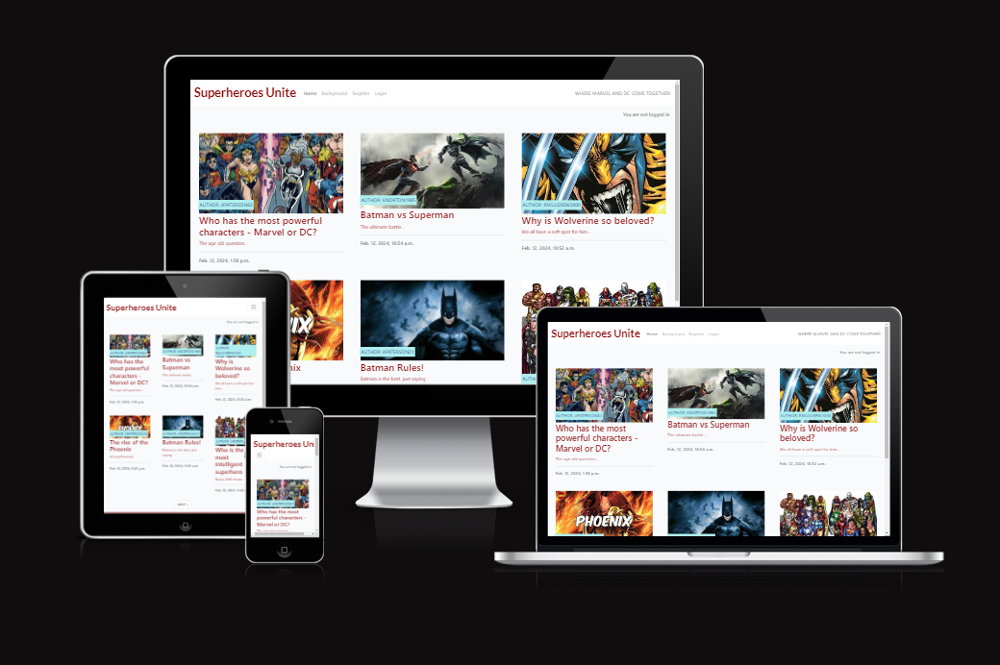
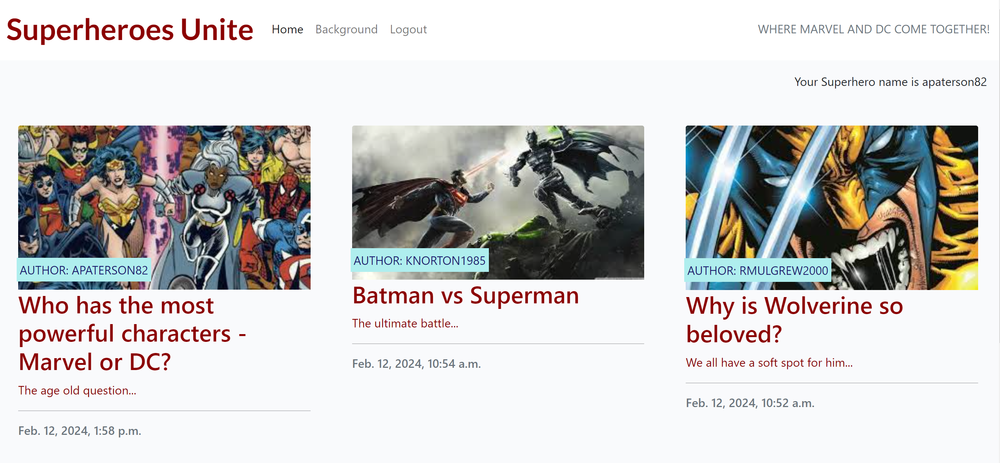
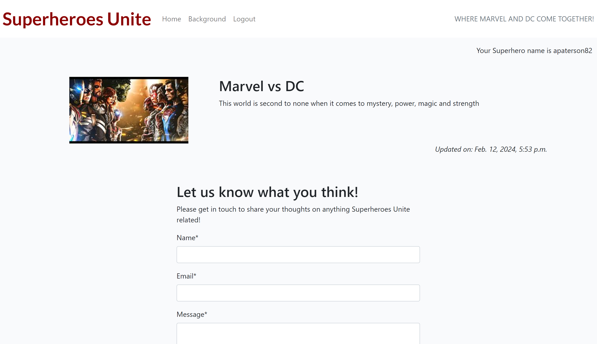
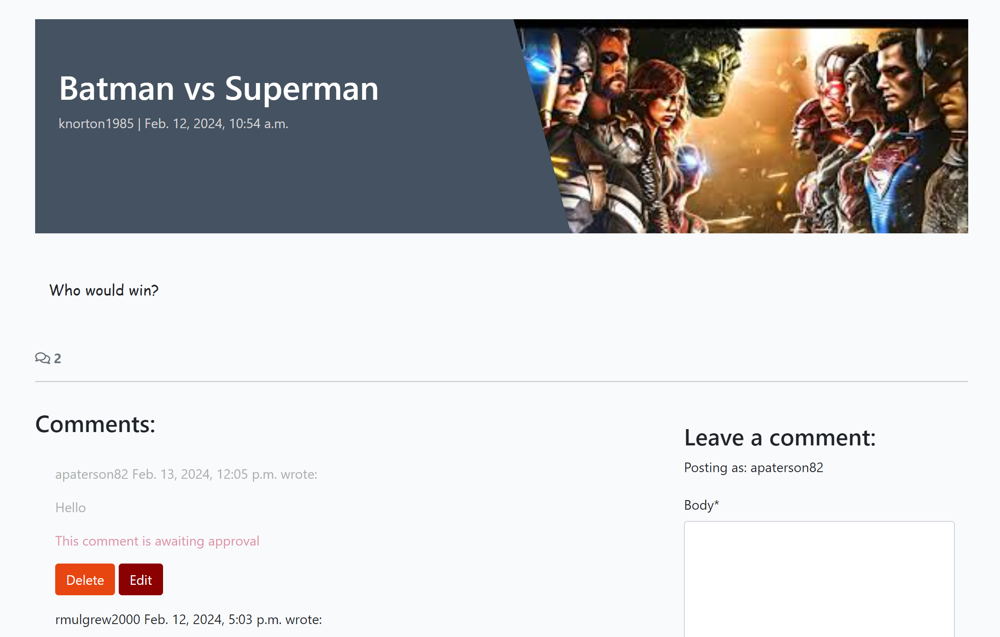
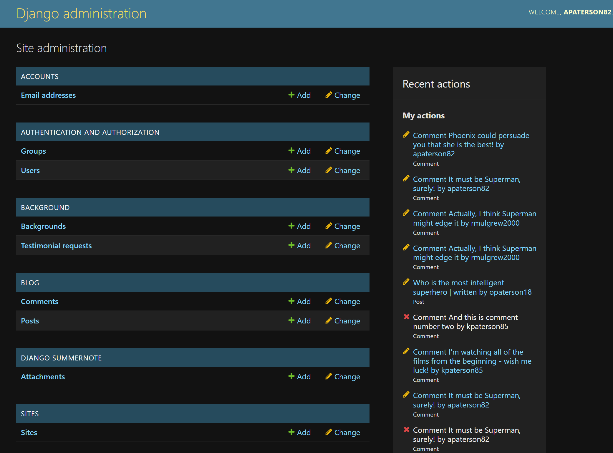
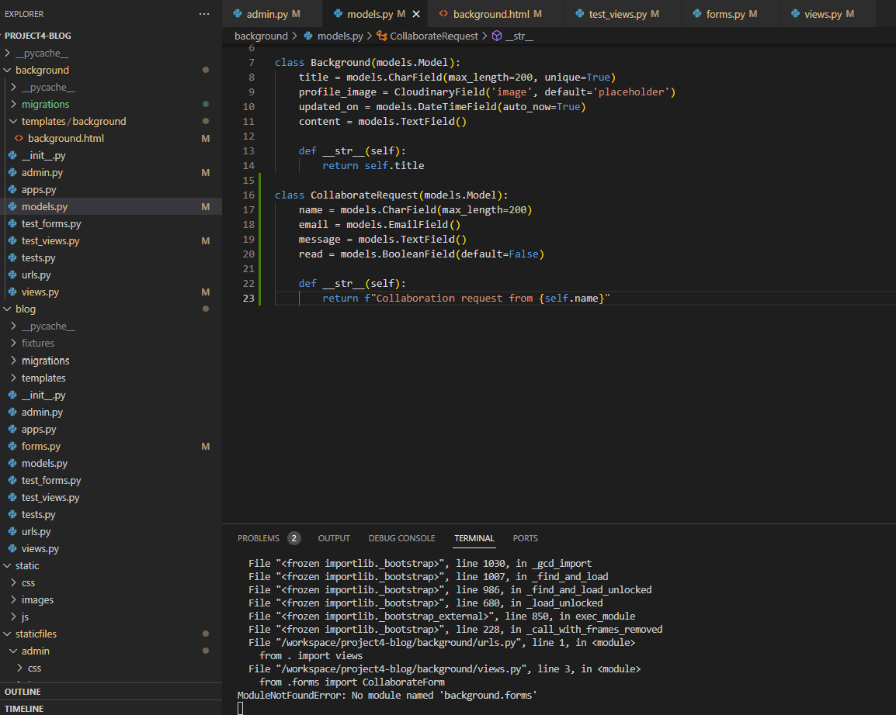
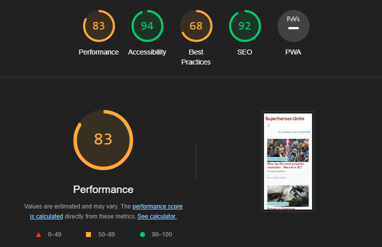
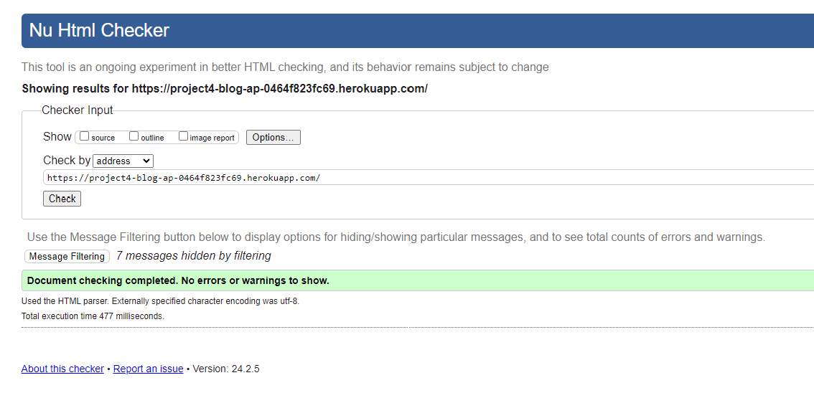
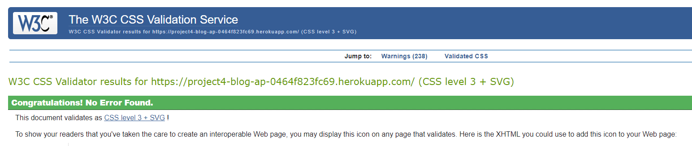

## Introduction

Superheroes Unite is my fourth portfolio project and is a Superhero blog with posts relating to the Marvel and DC Universes. It's aimed at anyone who has an exisitng, or new interest in the world of superheroes, and who may even be keen to submit their own comments on existing posts.

The full website is available to view [here](https://project4-blog-ap-0464f823fc69.herokuapp.com/)

## UX Design

### **Project Goals**

The primary goals for this project was to create a blog with full CRUD functionality so that users can register an account, view posts, add comments and also edit and delete them if needed.

### **Strategy**

An agile methodology was used when planning this project - a kanban board ([view it here](https://github.com/users/alanpaterson82/projects/7/views/1)) was used in Github with various issues having their own acceptance criteria and tasks to be completed.

## User Stories

As a user admin I can review and manage all content so that all inappropriate or irrelevant details can be removed

* AC1 - When logged in, they can read, review, edit and delete comments and posts

 

As a new user I can register my details so that I can access my account and post personalised content

* AC1 - Username/ email field to be added
* AC2 - Unique password field to be added
* AC3 - When logged in they can post under their unique details

 

As a site user I can comment on posts so that I can interact with others through personalised views and responses

* AC1 - When logged in, a user can add a comment
* AC2 - When logged in, any other users can respond
* AC3 - A conversation can be started

 

As a guest user I can view all posts so that I can gain information

* AC1 - A guest user can click on, and read, all comments and posts but will be unable to leave their own comment

 

As a site user I can edit and delete my comments so that I am in control of my personal content

* AC1 - When logged in, they can delete thier existing comments
* AC2 - When logged in, they can amend their existing comments

 

As a site user I can click on the Background link so that I can learn about the history of the blog content

* AC1 - When the background link is clicked the content is available to read

 

As a site admin I can update and amend the Background page so that it remains informative

* AC1 - The Background app can be seen in the admin portal

 

As a site user I can leave a comment so that the site admin can receive feedback

* AC1 - Site user can leave their personalised feedback
* AC2 - To leave a testimonial, input your name, username and message

 

As a site admin I can review testimonials so that the site can be improved where needed

* AC1 - Testimonials to be stored in the database for review

## Features

**Navigation Bar when logged out**

**Navigation Bar when logged in**

**Homepage**

**Background & Testimonial Page**

**Comments Page - Example**

**Django Administration**

## Technologies

**Languages:**

- Python
- JavaScript
- HTML5
- CSS

**Framework:**

- Django

**Database:**

- PostgreSQL

**Other**

- ElephantSQL
- GitHub - for storage and monitoring of the user stories
- Heroku - to deploy the app
- Cloudinary
- Chrome Developer Tools - to test responsiveness and generate a Lighthouse report
- Font Awesome - for any the site icons
- Am I Responsive - to demonstrate suitability on all devices
-CI's Python Linter - for automated testing of the Python code
- W3C Markup Validator - to test the HTML code
- W3C CSS Validator - to test the CSS code

## Manual Testing

Unfortunately, due to time constraints I was unable to complete the intended manual testing, however, testing was completed as the project took shape to ensure that there were no obvious issues.
 

## Browser compatibility

Tested in Google Chrome and on an phone 13 Pro Max

## Bugs resolved & unresolved

When implementing the testimonial form, there were various errors received (example above) due to incorrect coding which was eventually resolved using various resources including:

- Stack Overflow
- The Slack Community

There was a query regarding committing insecure keys, however this was resolved with the clarification of env.py being included in the .gitignore file.

AS I was referencing the walkthrough project, and was initially using CodeAnywhere before transferring to Gitpod Workspaces, there were certain queries to be overcome, including replacing certain code such as the CSRF Trusted Origins being amended to gitpod.io.

When trying to migrate with 0001_initial.py I received the following error:

_It is impossible to add a non-nullable field 'content' to post with specifying a default. From the source code, content = models. TextField() had no content in the parentheses._

The above was recolved with a system reset via Tutor Support.

## Lighthouse testing

## Code validation

**W3C Markup**

**W3C CSS**

## Deployment

## References

This project relied heavily on the walkthrough project I Think Therefore I Blog, with customisation added to demonstrate my capability and produce an interesting and unique app.
