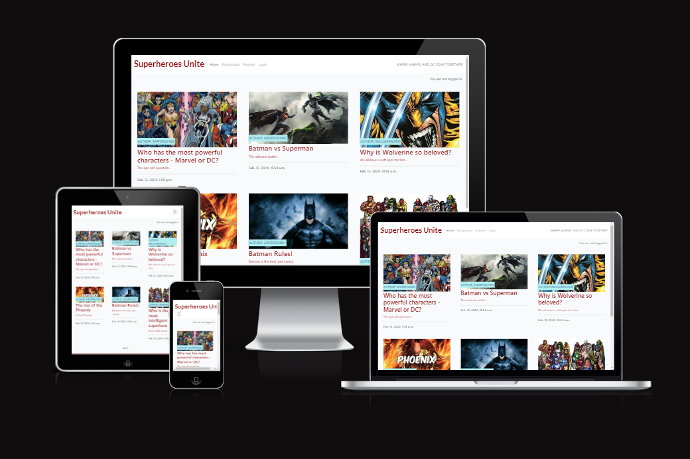
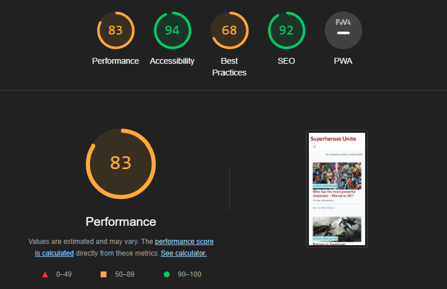

## Introduction

The website is available to view [here](https://project4-blog-ap-0464f823fc69.herokuapp.com/)

## UX Design
## Features
## Technologies
## Manual Testing
- Browser compatibility

Tested in Google Chrome, 

- Bugs resolved & unresolved
- Lighthouse testing

- Code validation
- User stories
- Features
## Deployment (inc. forking and cloning)
## References (include EVERYTHING!)
